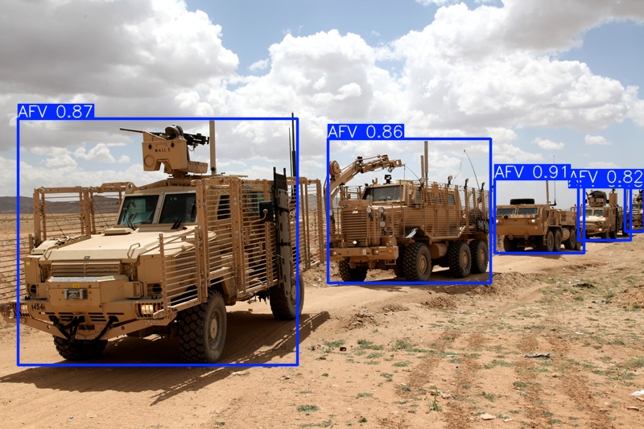

# Orion - Automated Target Recognition of Military Vehicles

🛰️ A deep-learning–based system for automated detection and classification of military vehicles in video data. Orion integrates visual recognition, motion analysis, and tracking modules to provide real-time situational awareness in complex environments.

<div align="center">
  
</div>

## Documentation

**Checkout Orion's [documentation](http://jrenault.fr/orion/) for help.**

## Models

Orion provides [YOLO12](https://docs.ultralytics.com/models/yolo12/) models fine-tuned on a [custom dataset](http://jrenault.fr/orion/datasets) of military vehicles with [4 classes](http://jrenault.fr/orion/classes).

| Model                                                                                  | size<br><sup>(pixels) | params<br><sup>(M)   |
| ------------------------------------------------------------------------------------   | --------------------- | -------------------- |
| [orion12n](https://github.com/jonasrenault/orion/releases/download/v2.0.0/orion12n.pt) | 640                   | 2.6                  |
| [orion12s](https://github.com/jonasrenault/orion/releases/download/v2.0.0/orion12s.pt) | 640                   | 9.3                  |
| [orion12m](https://github.com/jonasrenault/orion/releases/download/v2.0.0/orion12m.pt) | 640                   | 20.2                 |
| [orion12l](https://github.com/jonasrenault/orion/releases/download/v2.0.0/orion12l.pt) | 640                   | 26.4                 |

## Installation

Orion requires a recent version of python: .

### Install from github

Clone the repository and install the project in your python environment, either using `pip`

```bash
git clone https://github.com/jonasrenault/orion.git
cd orion
pip install --editable .
```

or [uv](https://docs.astral.sh/uv/)

```bash
git clone https://github.com/jonasrenault/orion.git
cd orion
uv sync
```

## Usage

### Command-line

When you install Orion in a virtual environment, it creates a CLI script called `orion`. Run

```bash
orion --help
```

to see the various commands available (or take a look at the [documentation](http://jrenault.fr/orion/) for examples).

#### Detect military vehicles in images

The `predict` command will use one of orion's models to detect military vehicles in images. For example, if you downloaded the [orion12m.pt](#models) model file into your current directory, and want to use it to detect military vehicles in an image, run

```bash
orion predict ./orion12m.pt resources/test/afvs.jpg -s
```

The `predict` command with the `-s` option will save the annotated image:

<div align="center">
  
</div>

#### Track military vehicles in videos

The `track` command will use one of orion's models to track military vehicles in videos. For example, if you downloaded the [orion12m.pt](#models) model file into your current directory, and want to use it to track military vehicles in a video, run

```bash
orion track ./orion12m.pt resources/test/mev1.mp4
```

<div align="center">
  
</div>

## Contents

- The [orion](./orion/) directory contains the source code used to fetch and format datasets for fine-tuning a YOLO12 model for object detection.
- The [resources](./resources/) directory contains video samples for vehicle detection task.
- The [notebooks](./notebooks/) directory contains exemple notebooks on how to
  1. [Prepare](./notebooks/01_Prepare.ipynb) a custom dataset of images annotated for automatic target recognition of military vehicles.
  2. [Train](./notebooks/02_Train.ipynb) a YOLO12 model using the prepared dataset.
  3. [Evaluate](./notebooks/03_Evaluate.ipynb) a fine-tuned model on a realistic test dataset.

## Run the notebooks

To run the notebooks, start a jupyter lab server with

```bash
jupyter lab
```

and open one of the notebooks in the `notebooks` directory.
