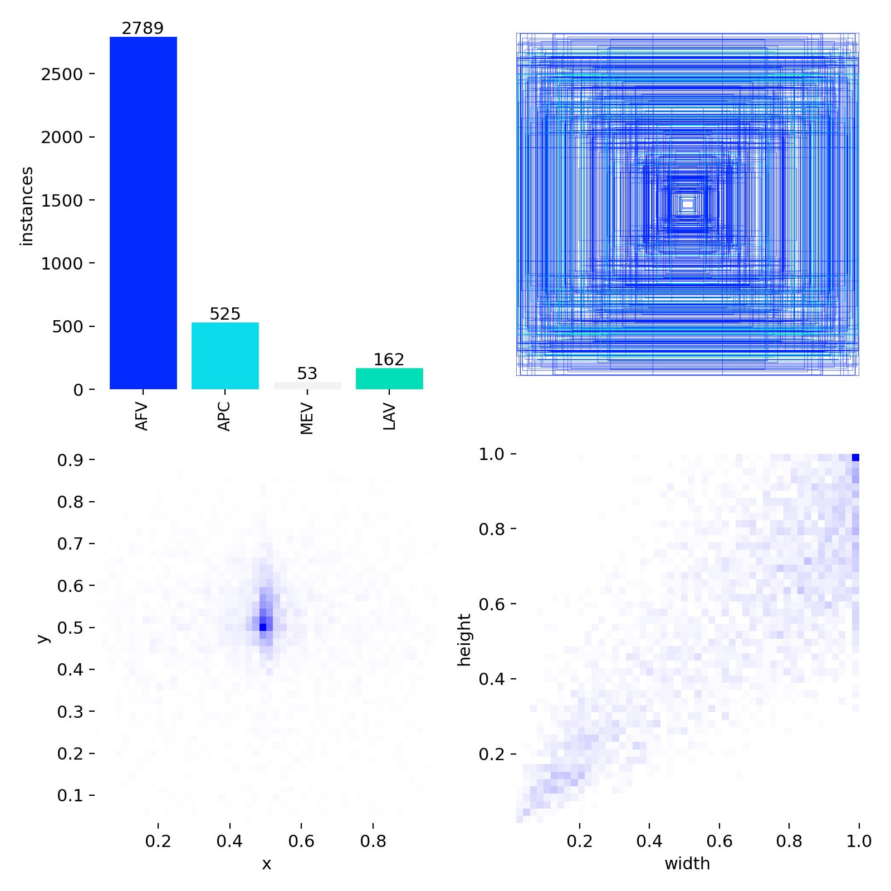

# Classes

Orion uses four broad classes of military vehicles that our model can discriminate:

1. **Armoured Fighting Vehicle (AFV)**
2. **Armoured Personnel Carrier (APC)**
3. **Military Engineering Vehicle (MEV)**
4. **Light Armoured Vehicle (LAV)**

## Class repartition

The AFV class is overrepresented in Orion's [dataset](./datasets.md) since most open source image datasets only label military vehicles as tanks.
