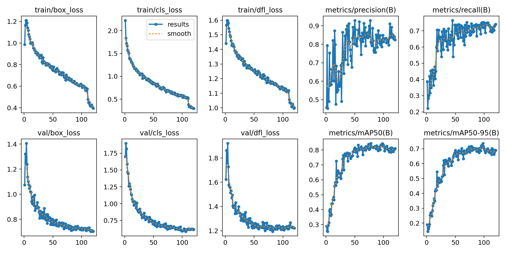
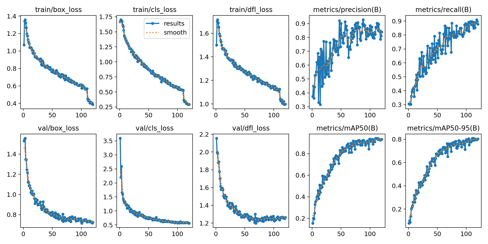
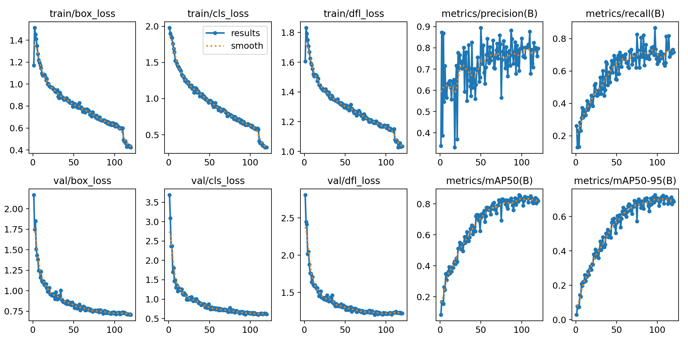
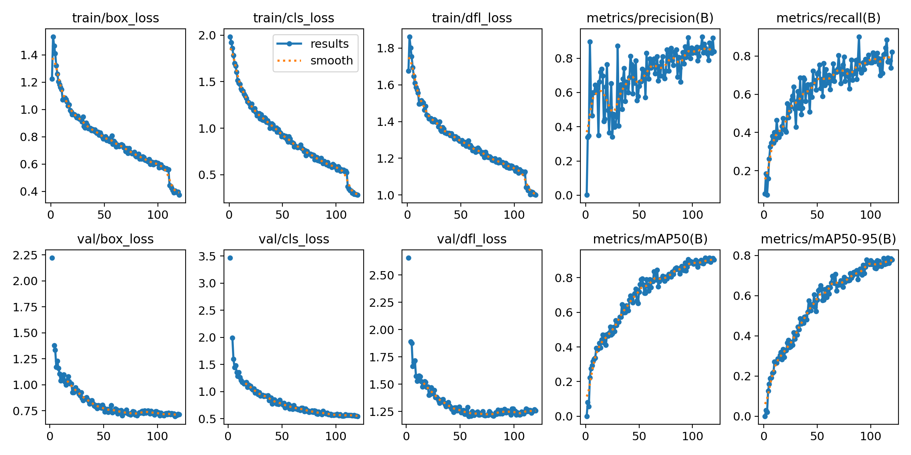

# Models

Orion provides [YOLO12](https://docs.ultralytics.com/models/yolo12/) models fine-tuned on a [custom dataset](datasets.md) of military vehicles with [4 classes](classes.md).

| Model                                                                                  | size (pixels) | params (M)   |
| ------------------------------------------------------------------------------------   | --------------------- | -------------------- |
| [orion12n](https://github.com/jonasrenault/orion/releases/download/v2.0.0/orion12n.pt) | 640                   | 2.6                  |
| [orion12s](https://github.com/jonasrenault/orion/releases/download/v2.0.0/orion12s.pt) | 640                   | 9.3                  |
| [orion12m](https://github.com/jonasrenault/orion/releases/download/v2.0.0/orion12m.pt) | 640                   | 20.2                 |
| [orion12l](https://github.com/jonasrenault/orion/releases/download/v2.0.0/orion12l.pt) | 640                   | 26.4                 |

## Training results

### Orion12n

### Orion12s

### Orion12m

### Orion12l

